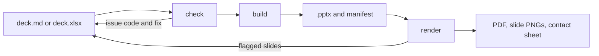

# deck-builder

Branded, fully editable PowerPoint decks from markdown or a spreadsheet, using a real PowerPoint template as the design system.

 

<p align="center">
  
</p>
<p align="center"><sub>One <code>deck.md</code>, built with three brand kits.</sub></p>

You or an agent write the content, and the engine handles layout, styling and validation. Every slide fills a placeholder in the template, and content that doesn't fit fails a check with a code that says how to fix it.

- **Editable output.** Real text in template placeholders, native charts and tables, speaker notes and alt text.
- **Markdown or Excel.** `deck.md` and `deck.xlsx` convert into each other without loss, and either one builds the deck.
- **Brands as data.** A brand kit is a template plus two YAML files. Generate one from your colors, fonts and logo, or wrap an existing template.
- **Existing decks, made consistent.** `import` turns a .pptx back into `deck.md`, drops one-off formatting and reports what needs a decision.
- **Visual QA.** Renders with PowerPoint or LibreOffice, measures where every word landed, and flags only the slides that need a look.
- **Deterministic and local.** The same input builds the same file, and the engine makes no network calls.

## Quick start

Needs [uv](https://docs.astral.sh/uv/). Rendering also needs poppler and either PowerPoint (Mac) or LibreOffice; `doctor` prints the install command for anything missing.

```bash
git clone <this repo> deck-builder && cd deck-builder
uv sync
uv run deck-builder doctor        # what this machine can do
uv run deck-builder init          # workspace/, config, the neutral brand, two example decks
uv run deck-builder check workspace/decks/quarterly-review --render
```

The last command validates the example deck, builds `workspace/out/quarterly-review.pptx`, and writes slide PNGs and a contact sheet next to it.

To work in another folder, install the CLI once with `uv tool install --editable /path/to/deck-builder`, then run `deck-builder init` there.

With Claude Code, open the clone and start a session. Onboarding runs these steps with you and then sets up your brand. `deck-builder skills install` adds the skills and agents to `~/.claude` for use in other repos.

## How a deck gets built



`check` catches what the text shows: unknown layouts, missing images and text over a field's character budget. `render` catches what only the rendered page shows: overflowing words, empty placeholders and substituted fonts. `deck-builder explain <CODE>` prints the cause and fix for any finding.

<p align="center">
  
</p>
<p align="center"><sub>A render's contact sheet. Flagged slides get a red border, so a reviewer reads one image instead of nine.</sub></p>

## A deck

One `##` heading is one slide. `key: value` lines fill the layout's fields, and the rest fills its body.

````markdown
---
brand: briarfield-paper
title: Briarfield Paper Co. Q3 review
---

## 18%
layout: big-number
caption: Growth in copy paper volume, Q2 to Q3

Notes:
Source: the Q3 shipment ledger.

## Cases shipped by month
layout: chart

```chart
type: column
categories: [Jul, Aug, Sep]
series:
  - name: Core line
    values: [9800, 10400, 11250]
```

## The new north warehouse
layout: image
caption: "Opened in August: same-day delivery for the northern accounts."


````

Field values are YAML, so quote a value that contains `: `. `deck-builder brand show <slug>` lists a brand's layouts, fields and character budgets. The showcase at the top is [this deck](tests/fixtures/demo-brands/showcase/deck.md), built into all three brands with `build --data`.

## Brands

```
brands/<slug>/
  brand.yaml       # palette, fonts, logos, icons, voice, lint rules
  tokens.yaml      # layouts -> template placeholders, with content budgets
  template.potx    # the design: masters, layouts, theme
  assets/          # logos and icons
```

| Starting point | Command |
|---|---|
| Your colors, fonts and logo | `deck-builder brand init <slug> --from brand.yaml` generates the template and `tokens.yaml` |
| An existing template | `deck-builder brand adopt <slug> --template client.potx` wraps it; a test render then tunes the budgets |
| Nothing yet | The `neutral` brand that `init` creates |

A deck names its brand with `brand: <slug>`, and `--brand` overrides it for one build. Brands are found under `brand_paths` in `deck-builder.toml`, so a client's kit can live in its own private repo. Nothing under `workspace/` is committed.

## Commands

| Command | Does |
|---|---|
| `init` | Create the workspace, config, neutral brand and example decks |
| `doctor` | Check Python packages, poppler, LibreOffice, PowerPoint and its automation permission |
| `check <deck> [--render]` | Validate a deck; with `--render`, also build, render and measure |
| `build <deck> [--data rows.csv]` | Build the `.pptx` and its manifest; with `--data`, one deck per row |
| `convert <in> <out>` | Convert between `.md`, `.xlsx` and `.csv`, refusing anything lossy |
| `import <pptx> <out>` | Turn an existing deck back into `deck.md`, its images and a report of what needs a decision |
| `render <pptx>` | PDF, slide PNGs, contact sheets, measured overflow, flagged slides |
| `brand list`, `brand show <slug>`, `brand check <slug>` | Find brands, see a brand's layouts and budgets, verify a kit |
| `brand init`, `brand adopt` | Generate a kit, or wrap an existing template |
| `inspect <template>` | A template's layouts, placeholders and theme |
| `assets <brand or deck>` | Logos, icons, colors and images, with the slides that use them |
| `docs [topic]`, `explain <CODE>` | Reference topics and issue-code fixes for the installed version |
| `skills install` | Link this clone's skills and agents into `~/.claude` |

A `<deck>` is a `.md`, `.xlsx` or `.csv` file, or a folder holding one. Every command takes `--json`. Exit codes are 0 for success, 1 for issues to fix and 2 for usage or environment problems.

`deck-builder docs` lists the reference topics for the installed version, and [docs/issue-codes.md](docs/issue-codes.md) lists every issue code.

## Claude Code

| Piece | Job |
|---|---|
| `deck-onboard` skill | Setup, missing tools, choosing a brand path, a first deck |
| `deck-brand` skill | Brand kits: colors, fonts, logos, icons, layouts, templates |
| `deck-builder` skill | Writing, checking, converting, building and reviewing decks |
| `deck-decomposer-agent` | Turns a folder of notes into an outline with sources and a draft `deck.md` to co-author |
| `deck-brand-agent` | Builds or adopts a brand kit and tunes its budgets with a test render |
| `deck-builder-agent` | Runs the check, build and render loop on a larger deck in its own context |

The agents have no shell. They reach the engine only through its MCP server (`deck-builder mcp`), confined to the workspace, so the CLI has to be on PATH (`uv tool install --editable <clone>`). They can still write files the session allows, so keep client work outside the clone. What an agent reads goes to Anthropic, as in any Claude Code session.

## Rules the engine keeps

- **Content in, design out.** Decks hold text, data and image references. Layout, fonts and colors come only from the brand kit, and budgets aren't loosened to make content fit.
- **Confined.** A deck reads images only inside its folder, a build writes only the `.pptx` files it made, and bulk data can't add slides or images. Imported decks are untrusted input.
- **Restraint.** Visual additions such as slide numbers, footers and status dots are the smallest mark that does the job.

## Status

v0.1.0. See [CHANGELOG.md](CHANGELOG.md). Known limits:

- The PowerPoint render backend hasn't been verified on a Mac with PowerPoint, so its renders warn `RENDER_UNVERIFIED`. LibreOffice renders are a close proxy.
- Icons are PNG alpha masks; SVG isn't supported.

## Development

```bash
uv run pytest                          # unit, round-trip and static tests, plus the render tier when LibreOffice is installed
uv run pytest -m render                # render tier only
uv run ruff check && uv run mypy
uv run python scripts/readme_images.py # regenerate the images in this README
```

The three fictional brands in `tests/fixtures/demo-brands/` are the test and showcase brands; their names and artwork were made for this repo. Releases follow [docs/release-checklist.md](docs/release-checklist.md).

## License

MIT. See [LICENSE](LICENSE).
