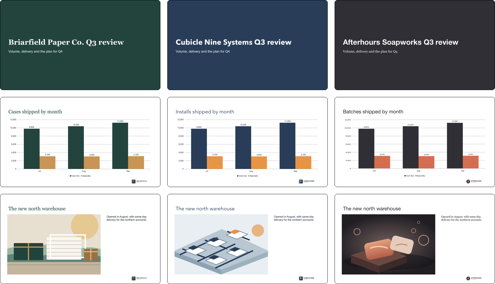
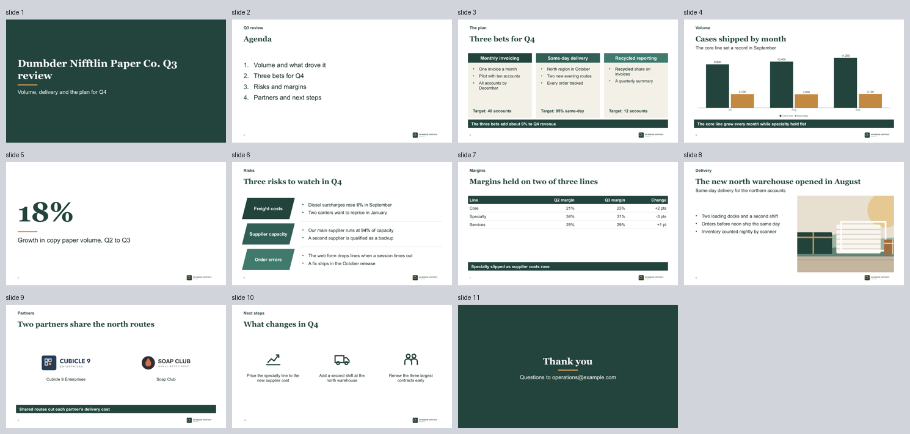

<h1 align="center">deck-builder</h1>

<p align="center">
  Turn markdown or Excel into fully editable PowerPoint decks, built on your own brand template.<br>
  Every build is deterministic, every slide is checked, and guided setup takes you from install to first deck.
</p>

<p align="center">
  
  
</p>

<p align="center">
  <a href="#install"><b>Install</b></a> &nbsp;|&nbsp;
  <a href="#how-it-works"><b>How it works</b></a> &nbsp;|&nbsp;
  <a href="#write-a-deck"><b>Write a deck</b></a> &nbsp;|&nbsp;
  <a href="#fix-up-an-existing-deck"><b>Fix up a deck</b></a> &nbsp;|&nbsp;
  <a href="#brands"><b>Brands</b></a> &nbsp;|&nbsp;
  <a href="#commands"><b>Commands</b></a> &nbsp;|&nbsp;
  <a href="#claude-code"><b>Claude Code</b></a>
</p>

<br>

<p align="center">
  
</p>
<p align="center"><sub>One <code>deck.md</code>, built three times with a different brand. Every chart is native and every word remains editable.</sub></p>

<br>

You or an agent supply the content, and deck-builder sets every slide in a placeholder of your PowerPoint template, so typography, color and layout always come from the brand. Content that exceeds its space fails validation with an issue code that explains the fix.

<table>
  <tr>
    <td width="33%" valign="top"><b>Built on your template</b><br>Generate a brand kit from your colors, fonts and logo, or adopt the PowerPoint template your team already uses.</td>
    <td width="33%" valign="top"><b>Markdown or Excel</b><br>Author in <code>deck.md</code> or <code>deck.xlsx</code>. The formats convert losslessly, so writers and reviewers each work in the one they prefer.</td>
    <td width="33%" valign="top"><b>Guided onboarding</b><br>In <a href="https://code.claude.com/docs/en/overview">Claude Code</a>, Anthropic's coding agent, onboarding checks your environment, configures your brand and builds a first deck with you.</td>
  </tr>
  <tr>
    <td valign="top"><b>Deterministic builds</b><br>Identical input produces an identical file, and the engine makes no network calls.</td>
    <td valign="top"><b>Native, editable output</b><br>Real text in template placeholders, native charts and tables, speaker notes and alt text. Nothing is flattened into images.</td>
    <td valign="top"><b>Automated visual QA</b><br>Each render measures where every word lands and flags only the slides that need review.</td>
  </tr>
</table>

## Install

Requires Python 3.11 or later. The commands below use [uv](https://docs.astral.sh/uv/), the quickest way to install; pipx or pip work too (see below). Rendering also requires poppler and LibreOffice, the verified renderer; PowerPoint on macOS is supported but not yet verified. `deck-builder doctor` checks what is installed.

```bash
git clone https://github.com/thefilesareinthecomputer/deck-builder.git && cd deck-builder
uv tool install .                     # deck-builder on your PATH, for you and for Claude Code's agents
deck-builder skills install --yes     # optional: the skills and agents in every Claude Code project
```

| Use it | Set up with | You get |
|---|---|---|
| **As a tool for agents and the CLI** (most common) | `uv tool install .` | `deck-builder` in any folder, and the MCP server (`deck-builder mcp`) the subagents run on |
| **As a skill in your other Claude Code projects** | `deck-builder skills install --yes`, after the tool | The three skills and three agents, linked into `~/.claude` |
| **From the clone**, to try it or work on it | `uv run deck-builder ...` | No install; a Claude Code session opened in the clone has the skills |

**Without uv:** `pipx install .`, or `pip install .` inside a virtual environment, puts the same `deck-builder` command on your PATH, and `deck-builder skills install --yes` follows as above.

After a `git pull`, update with `uv tool install --reinstall .` (or `pipx install --force .`). To work on the engine itself, install with `--editable` so the tool runs the clone's source.

## Quick start

```bash
deck-builder init --dir ~/decks       # a workspace: config, the neutral brand, two example decks
cd ~/decks
deck-builder check workspace/decks/quarterly-review --render
```

`check --render` validates, builds and renders the example deck. The deck is written to `workspace/out/quarterly-review.pptx`, and its slide images and contact sheet to `workspace/out/quarterly-review.render/`.

> [!TIP]
> **Working in Claude Code?** Ask in plain words: "set up deck-builder", "make a deck from these notes", "fix the fonts in this deck". Onboarding runs the steps above with you and then sets up your brand.

## How it works

A deck is a text file. Each `##` heading is one slide, and its `layout:` line picks one of the brand's layouts. A layout has fields, such as title, subtitle, body and caption, that map to placeholders in the PowerPoint template, and each field has a character budget: the most text that fits in its placeholder.

1. **Write** the content in `deck.md` or `deck.xlsx`.
2. **Check** it with `deck-builder check`. A layout the brand does not have, a missing image or text over a field's budget fails with an issue code, and `deck-builder explain <CODE>` describes the cause and the fix.
3. **Build** the `.pptx`. Every piece of text lands in a template placeholder, so fonts, colors and positions come from the template.
4. **Render** the `.pptx` to images and review the contact sheet, an overview image with up to 20 slides per sheet. The render measures where each word landed and flags slides with overflowing text, empty placeholders or substituted fonts.

`check --render` runs steps 2 through 4 in one command, which is what the quick start ran. Fix the flagged slides in the deck file and run it again.

<p align="center">
  
</p>
<p align="center"><sub>A contact sheet from a clean render, with nothing flagged. A flagged slide receives a red border and label, so a reviewer finds it without opening every slide.</sub></p>

## Write a deck

A deck and a brand are separate. The deck holds only content (text, data and image references) and names its brand with one line, `brand: <slug>`. The brand kit holds the whole design: template, fonts, colors, logos and budgets. Change that one line, or pass `--brand <slug>`, and the same content builds in a different design; the image at the top is one deck built that way three times.

`key: value` lines under a heading fill the layout's fields, and the rest of the slide fills its body. The three slides below form the first column of that image. They use the `dumbder-nifftlin` demo brand; to try them in the quick-start workspace, change the brand to `neutral` and point the image at a picture in the deck's folder.

````markdown
---
brand: dumbder-nifftlin
title: Dumbder Nifftlin Paper Co. Q3 review
---

## Dumbder Nifftlin Paper Co. Q3 review
layout: title
subtitle: Volume, delivery and the plan for Q4

## Cases shipped by month
layout: chart
takeaway: The core line grew every month while specialty held flat

```chart
type: column
number_format: '#,##0'
labels: true
categories: [Jul, Aug, Sep]
series:
  - name: Core line
    values: [9800, 10400, 11250]
  - name: Specialty
    values: [3100, 3050, 3120]
```

Notes:
Source: the Q3 shipment ledger.

## The new north warehouse
layout: image
caption: "Opened in August: same-day delivery for the northern accounts."


````

Field values are YAML, so quote any value that contains `: `. `deck-builder brand show <slug>` lists a brand's layouts, fields and character budgets. The [full showcase deck](tests/fixtures/demo-brands/showcase/deck.md) builds into all three brands with a single `build --data` command.

## Design

Every generated kit follows one design standard, built from presentation research and documented in `deck-builder docs design`. Titles are bold sentences in the same place on every slide. Short content sits at the optical center instead of hugging the top. Comparisons sit on tinted panels, tables are quiet (a dark header, thin rules, right-aligned figures, no word ever broken), bar charts start at zero, and an optional `takeaway:` band states each slide's conclusion. One short accent rule is the only decoration.

Set `generate.mode` in `brand.yaml` by how the deck is used: `projected` (the default) for a room, with nothing under 18 pt, or `read` for decks sent ahead and read on screen, with a 14 pt body on a readable measure. `generate.type` adjusts any size.

`generate.layout_set: designed` adds layouts built from shapes rather than loose text: cards with colored label bands, process chevrons and labeled bands, plus a section label and a subtitle line on every content slide. Images with transparent pixels, such as logos, are fitted inside their box instead of cropped.

## Fix up an existing deck

To make a deck consistent (fonts, sizes, colors and slide numbers) or move it onto your brand, import it and rebuild:

```bash
deck-builder import old.pptx workspace/decks/refresh --brand <slug>
deck-builder check workspace/decks/refresh --render
```

`import` turns the .pptx back into `deck.md` and its images, and the rebuild takes every style from the brand and numbers every content slide. The original file is never changed. Anything that doesn't map to a layout field, such as SmartArt or a stray text box, is listed in `import-report.md` and kept in that slide's speaker notes, so nothing is lost. In Claude Code, ask for it directly: "fix the fonts and slide numbers in this deck" or "put this deck on our brand".

## Brands

```
brands/<slug>/
  brand.yaml       # the recipe: palette, fonts, logos, icons, voice, lint rules, mode and type scale
  assets/          # the ingredients: logos and icons
  template.potx    # generated: masters, layouts, theme
  tokens.yaml      # generated: layouts -> placeholders, budgets, table and chart styling, what made the kit
  references/      # optional: past decks to match, read-only
```

A generated kit is self-contained: `brand init <slug> --force` rebuilds it from its own recipe and ingredients, and `brand check` warns `KIT_STALE` when the recipe changed since.

| Starting point | Command |
|---|---|
| Your colors, fonts and logo | `deck-builder brand init <slug> --from brand.yaml` generates the template and `tokens.yaml` |
| An existing template | `deck-builder brand adopt <slug> --template client.potx` wraps it; a test render then tunes the budgets |
| Nothing yet | The `neutral` brand that `init` creates |

A deck selects its brand with `brand: <slug>`, and `--brand` overrides it for a single build. Brands resolve from the `brand_paths` in `deck-builder.toml`, so a client kit can live in its own private repository.

## Commands

| Command | Does |
|---|---|
| `init` | Create the workspace, config, neutral brand and example decks |
| `doctor` | Check Python packages, poppler, LibreOffice, PowerPoint and its automation permission |
| `check <deck> [--render]` | Validate a deck; with `--render`, also build, render and measure |
| `build <deck> [--data rows.csv]` | Build the `.pptx` and its manifest; with `--data`, one deck per row |
| `convert <in> <out>` | Convert between `.md`, `.xlsx` and `.csv`, refusing anything lossy |
| `import <pptx> <out>` | Turn an existing deck back into `deck.md`, its images and a report of what needs a decision |
| `render <pptx>` | PDF, slide PNGs, contact sheets, measured overflow, flagged slides |
| `brand list`, `brand show <slug>`, `brand check <slug>` | Find brands, see a brand's layouts and budgets, verify a kit |
| `brand init`, `brand adopt` | Generate a kit, or wrap an existing template; `brand init <slug> --force` regenerates a kit from its own `brand.yaml` |
| `brand add-asset <slug> <png> --as logo/<id>` | Copy a logo or icon (`icon/<id>`) into a kit |
| `inspect <template>` | A template's layouts, placeholders and theme |
| `assets <brand or deck>` | Logos, icons, colors and images, with the slides that use them |
| `docs [topic]`, `explain <CODE>` | Reference topics and issue-code fixes for the installed version |
| `schema brand\|tokens\|manifest` | The JSON Schema for `brand.yaml`, `tokens.yaml` or a build manifest |
| `skills install` | Link this clone's skills and agents into `~/.claude` |
| `mcp` | Serve the engine as MCP tools over stdio for the agents, confined to the workspace |

A `<deck>` is a `.md`, `.xlsx` or `.csv` file, or a folder containing one. Every command accepts `--json`. Exit codes are 0 for success, 1 for issues to fix and 2 for usage or environment errors. `deck-builder docs` lists the reference topics, and [docs/issue-codes.md](docs/issue-codes.md) documents every issue code.

## Claude Code

deck-builder includes skills and agents for Claude Code. Describe the deck you need, from a brief or a folder of notes, and review the rendered result.

| Piece | Job |
|---|---|
| `deck-onboard` skill | Setup, missing tools, choosing a brand path, a first deck |
| `deck-brand` skill | Brand kits: colors, fonts, logos, icons, layouts, templates |
| `deck-builder` skill | Writing, checking, converting, building and reviewing decks |
| `deck-decomposer-agent` | Turns a folder of notes into an outline with sources and a draft `deck.md` to co-author |
| `deck-brand-agent` | Builds or adopts a brand kit and tunes its budgets with a test render |
| `deck-builder-agent` | Runs the check, build and render loop on a larger deck in its own context |

The agents have no shell access. They reach the engine only through its MCP server (`deck-builder mcp`), confined to the workspace (and the configured `brand_paths` folders for brand tools) and refusing this clone's own `src/`, `.claude/` and `.git/` regardless of those settings; the CLI must be on your PATH (`uv tool install .` from the repository). `deck-builder skills install --yes` makes the skills and agents available in other projects.

> [!NOTE]
> The engine runs locally, but content an agent reads is sent to Anthropic, as in any Claude Code session. The MCP server confines the engine's own tools; each agent's own Write and Edit tools are limited only by its instructions, not by code, so keep client work outside the clone.

## Principles

- **Content in, design out.** Decks contain text, data and image references. Layout, typography and color come only from the brand kit, and budgets are never relaxed to make content fit.
- **Confined by default.** A deck reads images only from its own folder, a build writes only the `.pptx` files it creates, and bulk data cannot add slides or images. Imported decks are treated as untrusted input. The MCP server's tools are confined to the workspace (and `brand_paths` for brand tools) and refuse this clone's own `src/`, `.claude/` and `.git/`; an agent's own Write and Edit tools are limited only by its instructions, not by code.
- **Restraint.** Visual additions such as slide numbers, footers and status dots use the smallest mark that does the job.

## Status

Current release: v0.1.0. See the [changelog](CHANGELOG.md). Known limitations:

- The PowerPoint render backend has not yet been verified on a Mac with PowerPoint installed, so its renders include the `RENDER_UNVERIFIED` warning. LibreOffice renders are a close proxy.
- Icons are PNG alpha masks; SVG is not supported.

## Development

```bash
uv run pytest                          # unit, round-trip and static tests, plus the render tier when LibreOffice is installed
uv run pytest -m render                # render tier only
uv run ruff check && uv run mypy
uv run python scripts/readme_images.py # regenerate the images in this README
```

| Script | Does |
|---|---|
| `scripts/readme_images.py` | Builds the showcase deck in the three demo brands and redraws `docs/images/` |
| `scripts/demo_brand_logos.py` | Redraws the demo brands' logo wordmarks from their SVG sources (macOS fonts) |
| `scripts/make_example_assets.py` | Draws the neutral brand's logo and icons and the example deck's image |
| `scripts/probe_powerpoint.sh <deck.pptx>` | Tests the PowerPoint render backend on a Mac with PowerPoint |

The three fictional brands in `tests/fixtures/demo-brands/` serve as the test and showcase brands; their names and artwork were created for this repository. Everything under `workspace/` is ignored by git, so decks and brands created there stay out of the repository. Releases follow the [release checklist](docs/release-checklist.md).

## License

Released under the [MIT License](LICENSE).
