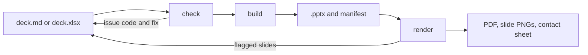

# deck-builder

Branded, fully editable PowerPoint decks from markdown or a spreadsheet, using a real PowerPoint template as the design system.

<p align="center">
  
</p>
<p align="center"><sub>One <code>deck.md</code>, three brands. Each column is the same file built with a different brand kit.</sub></p>

You, or an agent, write the content. The engine owns layout, styling and validation: every slide fills a placeholder in the template, nothing is improvised, and anything that doesn't fit fails a check with a code that says how to fix it. The same input always builds the same file.

- **Editable output.** Real text in template placeholders, native PowerPoint charts and tables, speaker notes and alt text. No slides made of pictures.
- **Markdown or Excel, interchangeably.** `deck.md` and `deck.xlsx` hold the same deck and convert into each other without loss, so a deck can start in markdown, go to a team as a workbook, and build from either.
- **Brands as data.** A brand kit is a template plus two YAML files. Generate one from your colors, fonts and logo, wrap an existing client template, or start from the neutral example.
- **Existing decks, made consistent.** `import` turns a .pptx with many hands in it back into `deck.md`, drops the one-off formatting, and reports what needs a decision, so the deck rebuilds in one brand.
- **Visual QA an agent can afford.** Renders with PowerPoint on a Mac or with LibreOffice, measures where every word landed, and flags only the slides that need a look.
- **Local.** The engine makes no network calls and sends nothing anywhere.

---

## Quick start

Needs [uv](https://docs.astral.sh/uv/). Rendering also needs poppler and either Microsoft PowerPoint (Mac) or LibreOffice; `doctor` prints the install command for anything missing.

```bash
git clone <this repo> deck-builder && cd deck-builder
uv sync
uv run deck-builder doctor        # what this machine can do
uv run deck-builder init          # workspace/, config, the neutral brand, two example decks
uv run deck-builder check workspace/decks/quarterly-review --render
```

The last command validates the deck, builds `workspace/out/quarterly-review.pptx`, renders it, and writes slide PNGs and a contact sheet beside it.

**Working in your own folder.** Install the CLI once with `uv tool install --editable /path/to/deck-builder`, then run `deck-builder init` in any folder. Without installing, run `uv run --project /path/to/deck-builder deck-builder <command>` from that folder.

**With Claude Code.** Open the clone and start a session; onboarding runs the steps above with you, then helps set up your own brand. `deck-builder skills install` links the skills and agents into `~/.claude` for use in other repos.

---

## How a deck gets built



`check` catches what the text alone can show: unknown layouts, missing images, and text over a field's character budget. `render` catches what only a rendered page shows: words that ran past their box, empty placeholders and substituted fonts. Each finding has a stable code, and `deck-builder explain <CODE>` prints its cause and fix.

<p align="center">
  
</p>
<p align="center"><sub>The contact sheet a render writes. A flagged slide gets a red border and label, so a reviewer reads one image instead of nine.</sub></p>

---

## A deck

One `##` heading is one slide. Lines of `key: value` under it fill the layout's fields, and what follows fills its body.

````markdown
---
brand: briarfield-paper
title: Briarfield Paper Co. Q3 review
---

## 18%
layout: big-number
caption: Growth in copy paper volume, Q2 to Q3

Notes:
Source: the Q3 shipment ledger.

## Cases shipped by month
layout: chart

```chart
type: column
categories: [Jul, Aug, Sep]
series:
  - name: Core line
    values: [9800, 10400, 11250]
```

## The new north warehouse
layout: image
caption: "Opened in August: same-day delivery for the northern accounts."


````

Field values are YAML, so a value containing `: ` goes in quotes, as in the last caption. `deck-builder brand show <slug>` lists a brand's layouts, their fields and their character budgets. The deck in the image at the top is [tests/fixtures/demo-brands/showcase/deck.md](tests/fixtures/demo-brands/showcase/deck.md), built into all three brands in one command with `--data`.

---

## Brands

```
brands/<slug>/
  brand.yaml       # palette, fonts, logos, icons, voice, lint rules
  tokens.yaml      # layouts -> template placeholders, with content budgets
  template.potx    # the design: masters, layouts, theme
  assets/          # logos and icons
```

| Starting point | Command |
|---|---|
| Your colors, fonts and logo | `deck-builder brand init <slug> --from brand.yaml` generates the template and `tokens.yaml` |
| An existing client template | `deck-builder brand adopt <slug> --template client.potx` wraps it; then name the layouts and tune the budgets with a test render |
| Nothing yet | The `neutral` brand that `init` creates |

Decks name a brand with `brand: <slug>`, and `--brand` overrides it for one build. Brands are found under the `brand_paths` in `deck-builder.toml`, so a client's kit can live in its own private repo. Client material never belongs in this repo: everything under `workspace/` is gitignored.

---

## Commands

| Command | Does |
|---|---|
| `init` | Create the workspace, config, neutral brand and example decks |
| `doctor` | Check Python packages, poppler, LibreOffice, PowerPoint and its automation permission |
| `check <deck> [--render]` | Validate a deck; with `--render`, also build, render and measure |
| `build <deck> [--data rows.csv]` | Build the `.pptx` and its manifest; with `--data`, one deck per row |
| `convert <in> <out>` | Convert between `.md`, `.xlsx` and `.csv`, refusing anything lossy |
| `import <pptx> <out>` | Turn an existing deck back into `deck.md`, its images and a report of what needs a decision |
| `render <pptx>` | PDF, slide PNGs, contact sheets, measured overflow, flagged slides |
| `brand list`, `brand show <slug>`, `brand check <slug>` | Find brands, see a brand's layouts and budgets, verify a kit |
| `brand init`, `brand adopt` | Generate a kit, or wrap an existing template |
| `inspect <template>` | A template's layouts, placeholders and theme |
| `assets <brand or deck>` | Logos, icons, colors and images, with the slides that use them |
| `docs [topic]`, `explain <CODE>` | Reference topics and issue-code fixes for the installed version |
| `skills install` | Link this clone's skills and agents into `~/.claude` |

A `<deck>` is a `.md`, `.xlsx` or `.csv` deck file, or a folder holding `deck.md`, `deck.xlsx` or `deck.csv`. Every command takes `--json`. Exit codes are 0 for success, 1 for issues to fix and 2 for usage or environment problems.

**Reference.** `deck-builder docs <topic>` prints the reference for the installed version: `deck-md`, `workbook`, `brand-yaml`, `tokens-yaml`, `workflow` and `codes`. The `docs/` folder holds the generated [issue-code list](docs/issue-codes.md), the [release checklist](docs/release-checklist.md) and the images in this README.

---

## Claude Code

| Piece | Job |
|---|---|
| `deck-onboard` skill | Setup, missing tools, choosing a brand path, a first deck |
| `deck-brand` skill | Brand kits: colors, fonts, logos, icons, layouts, templates |
| `deck-builder` skill | Writing, checking, converting, building and reviewing decks |
| `deck-decomposer-agent` | Turns a folder of notes into an outline with sources and a draft `deck.md` to co-author |
| `deck-brand-agent` | Builds or adopts a brand kit and tunes its budgets with a test render |
| `deck-builder-agent` | Runs the check, build and render loop on a larger deck in its own context |

The agents have no shell: they reach the engine only through the deck-builder MCP server (`deck-builder mcp`), whose tools are confined to the workspace, so they need the CLI on PATH (`uv tool install --editable <clone>`).

The engine does all the deterministic work, so the model spends its tokens on content and review. The engine is local; when you use the Claude Code layer, what the agent reads is sent to Anthropic like any Claude Code session.

---

## Status

v0.1.0, with the changes since in [CHANGELOG.md](CHANGELOG.md). Known limits:

- The PowerPoint render backend hasn't been verified on a Mac with PowerPoint yet. Its results include the warning `RENDER_UNVERIFIED` until `scripts/probe_powerpoint.sh` passes; LibreOffice renders are a close proxy.
- Icons are PNG alpha masks; SVG isn't supported.

### Rules the engine keeps

- **Deterministic and local.** The same input builds the same file, and the engine makes no network calls.
- **Content in, design out.** Decks hold text, data and image references; layout, fonts and colors come only from the brand kit. Content that doesn't fit fails `check` with a code, and budgets aren't loosened to pass.
- **Confined.** A deck reads images only inside its folder, writes only `.pptx` files it built, and bulk data can't add slides or images. Imported decks are untrusted input.
- **Agents have no shell.** The subagents reach the engine only through `deck-builder mcp`, confined to the workspace. They can still write files the session allows, so keep client work outside the clone.
- **Restraint.** Visual additions (slide numbers, footers, status dots) are the smallest mark that does the job.

The original design spec, with its requirements and open decisions, is archived at [tasks/completed/SPEC-2026-10-02.md](tasks/completed/SPEC-2026-10-02.md).

---

## Development

```bash
uv run pytest                          # unit, round-trip and static tests, plus the render tier when LibreOffice is installed
uv run pytest -m render                # render tier only
uv run ruff check && uv run mypy
uv run python scripts/readme_images.py # regenerate the images in this README
```

The three fictional brands in `tests/fixtures/demo-brands/` are the test and showcase brands; their names and artwork were made for this repo.

## License

MIT. See [LICENSE](LICENSE).
