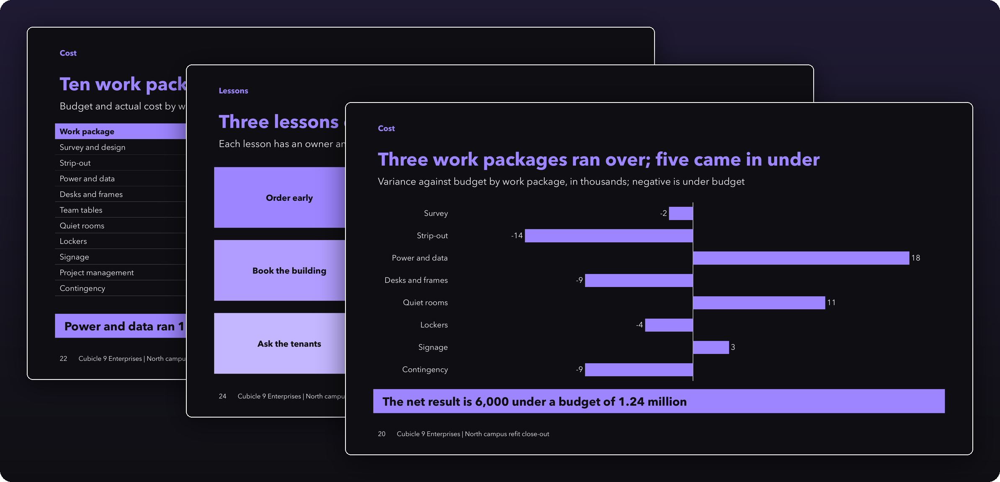
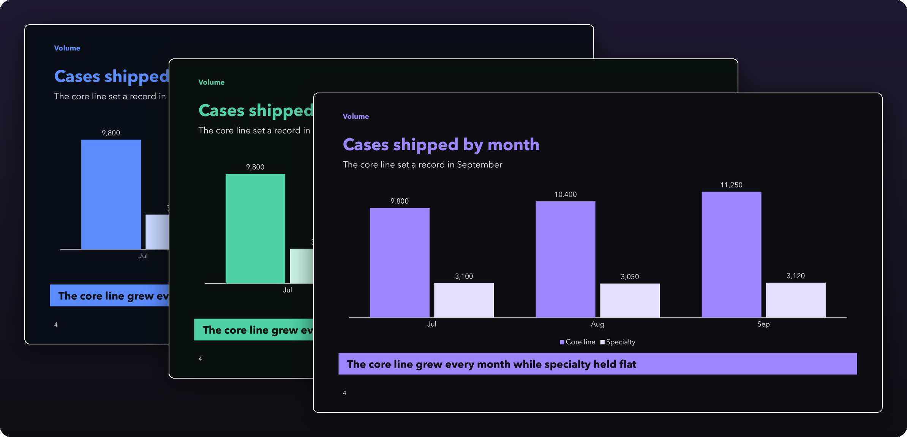

<h1 align="center">deck-builder</h1>

<p align="center">
  Write your slides in markdown or Excel and get back a real, editable PowerPoint deck on your own brand template.
</p>

<p align="center">
  
  
</p>

<p align="center">
  <a href="#install"><b>Install</b></a> &nbsp;|&nbsp;
  <a href="#quick-start"><b>Quick start</b></a> &nbsp;|&nbsp;
  <a href="#write-a-deck"><b>Write a deck</b></a> &nbsp;|&nbsp;
  <a href="#brands"><b>Brands</b></a> &nbsp;|&nbsp;
  <a href="#claude-code"><b>Claude Code</b></a> &nbsp;|&nbsp;
  <a href="#updating"><b>Updating</b></a>
</p>

<br>

<p align="center">
  
</p>
<p align="center"><sub>Slides from one deck in a dark brand kit. The chart is a native PowerPoint chart, and every word is still editable.</sub></p>

<br>

You (or an agent) write the content. deck-builder puts each piece of it into a placeholder in your PowerPoint template, so the fonts, colors and layout always come from your brand. If something doesn't fit, `check` tells you what's wrong and how to fix it.

- **Built on your template.** Generate a brand kit from your colors, fonts and logo, or adopt the template your team already has.
- **Markdown or Excel.** Write `deck.md` or `deck.xlsx`. They convert back and forth without losing anything.
- **Native and editable.** You get real text, charts, tables, speaker notes and alt text, never a flattened picture.
- **Same input, same file.** A build always gives the same file for the same input, and the engine never goes online.
- **Checked by measure.** Each render measures where every word landed and flags only the slides you need to look at.
- **Guided setup.** In [Claude Code](https://code.claude.com/docs/en/overview), onboarding checks your setup, sets up your brand and builds a first deck with you.

## Install

You need Python 3.11 or later. To render slides you also need poppler and LibreOffice, and `deck-builder doctor` tells you what's installed. PowerPoint on a Mac can render too, but we haven't verified that backend yet.

```bash
git clone https://github.com/thefilesareinthecomputer/deck-builder.git && cd deck-builder
uv tool install .                     # deck-builder on your PATH, for you and for Claude Code's agents
deck-builder skills install --yes     # optional: the skills and agents in every Claude Code project
```

Without [uv](https://docs.astral.sh/uv/), `pipx install .`, or `pip install .` inside a virtual environment, puts the same command on your PATH. To try it without installing, run `uv run deck-builder ...` in the clone; a Claude Code session opened there already has the skills. If you're working on the engine itself, install with `--editable` so the tool runs straight from the clone.

## Quick start

```bash
deck-builder init --dir ~/decks       # a workspace: config, the neutral brand, two example decks
cd ~/decks
deck-builder check workspace/decks/quarterly-review --render
```

`check --render` checks the example deck, builds it and renders it. The deck lands in `workspace/out/quarterly-review.pptx`. Its slide images and a contact sheet go in `workspace/out/quarterly-review.render/`, where a flagged slide gets a red border, so you only open the slides that need a look.

> [!TIP]
> **Using Claude Code?** Just ask: "set up deck-builder", "make a deck from these notes", "fix the fonts in this deck".

## Write a deck

A deck is a text file. Each `##` heading starts a slide, and its `layout:` line picks one of the brand's layouts. Each `key: value` line fills one of that layout's fields, the rest of the slide goes into the body, and `### name` starts the content of a named field, like each card's bullets:

````markdown
---
brand: dumbder-nifftlin
title: Dumbder Nifftlin Paper Co. Q3 review
kicker: Q3 review
---

## Dumbder Nifftlin Paper Co. Q3 review
layout: title
subtitle: Volume, delivery and the plan for Q4

## Three bets for Q4
layout: cards-3
kicker: The plan
label1: Monthly invoicing
footer1: "Target: 40 accounts"
label2: Same-day delivery
footer2: "Target: 95% same-day"
label3: Recycled reporting
footer3: "Target: 12 accounts"
takeaway: The three bets add about 9% to Q4 revenue

### body1
- One invoice a month
- Pilot with ten accounts
- All accounts by December

### body2
- North region in October
- Two new evening routes
- Every order tracked

### body3
- **Recycled** share on invoices
- A quarterly summary

## Cases shipped by month
layout: chart
kicker: Volume
subtitle: The core line set a record in September
takeaway: The core line grew every month while specialty held flat

```chart
type: column
number_format: '#,##0'
labels: true
categories: [Jul, Aug, Sep]
series:
  - name: Core line
    values: [9800, 10400, 11250]
  - name: Specialty
    values: [3100, 3050, 3120]
```

Notes:
Source: the Q3 shipment ledger.
````

Field values are YAML, so put quotes around any value with `: ` in it. This example uses the `dumbder-nifftlin` demo brand; to try it in your quick-start workspace, change the brand to `neutral`.

The deck holds only content, and its `brand:` line names the kit that holds the design. Change that line, or pass `--brand <slug>`, and the same content builds in a different design:

<p align="center">
  
</p>
<p align="center"><sub>The chart slide from the example, built in three brand kits.</sub></p>

Every field has a budget, the most text that fits its box, and `deck-builder brand show <slug>` lists a brand's layouts, fields and budgets. When a slide uses a layout the brand doesn't have, names a missing image or runs over a budget, `check` reports an issue code, and `deck-builder explain <CODE>` gives the cause and the fix.

The format covers more than text. Code goes in a fenced block with its language and builds as highlighted, editable text. Screenshots and photos go on the image layouts, and `deck-builder assets --images <deck>` says where each image lands. In `deck.xlsx` each slide is a row, and `build --data rows.csv` builds one deck per row. `deck-builder docs deck-md` has the whole format, `docs design` the design rules, and `docs voice` the writing rules.

## Fix up an existing deck

To clean up a deck's fonts, sizes, colors and slide numbers, or to move it onto your brand, import it and rebuild it:

```bash
deck-builder import old.pptx workspace/decks/refresh --brand <slug>
deck-builder check workspace/decks/refresh --render
```

`import` turns the .pptx back into `deck.md` plus its images, and the rebuild takes every style from the brand. Your original file is never touched. Anything that doesn't fit a layout field, like SmartArt or a stray text box, goes into `import-report.md` and that slide's speaker notes, so nothing gets lost.

## Brands

```
brands/<slug>/
  brand.yaml       # the recipe: palette, fonts, logos, icons, voice, lint rules, mode and type scale
  assets/          # logos and icons
  template.potx    # generated: masters, layouts, theme
  tokens.yaml      # generated: layouts -> placeholders, budgets, table and chart styling
```

| Starting point | Command |
|---|---|
| Your colors, fonts and logo | `deck-builder brand init <slug> --from brand.yaml` generates the template and `tokens.yaml` |
| An existing template | `deck-builder brand adopt <slug> --template client.potx` wraps it, and a test render tunes the budgets |
| Nothing yet | The `neutral` brand that `init` creates |

Every generated kit follows one design standard, based on presentation research and WCAG 2.2 AA. `generate.mode: projected`, the default, keeps text at 18 pt or more for a room, and `read` suits decks people read on their own screen. `generate.layout_set: designed` adds cards, process steps, labeled bands and a logo row. `brand check` warns about low contrast, chart colors that look alike to people with color blindness, and type that's too small. `deck-builder docs design` has the full rules.

Brands are found through `brand_paths` in `deck-builder.toml`, so a kit can live in any folder.

## Claude Code

deck-builder comes with skills and agents for Claude Code. Describe the deck you need, from a brief or a folder of notes. The agents draft the storyline with you, build the deck and proofread its render before you see it, and the brand skill sets up a kit from your colors, fonts and logo.

The agents can't run shell commands. They reach the engine only through its MCP server (`deck-builder mcp`), which keeps them inside the workspace. `deck-builder skills install --yes` makes the skills and agents available in your other projects.

## Commands

`deck-builder --help` lists every command, and `deck-builder <command> --help` its options. The ones you'll use most:

| Command | Does |
|---|---|
| `init`, `doctor` | Create a workspace; check what's installed |
| `check <deck> [--render]` | Check a deck; with `--render`, also build, render and measure it |
| `build <deck>` | Build the `.pptx` |
| `convert <in> <out>` | Convert between `.md`, `.xlsx` and `.csv` |
| `import <pptx> <out>` | Turn an existing deck back into `deck.md` |
| `brand list`, `brand show`, `brand init`, `brand adopt` | Find, read and make brand kits |
| `docs [topic]`, `explain <CODE>` | Reference topics and issue-code fixes |

Every command takes `--json`. The exit code is 0 for success, 1 when there are issues to fix and 2 for a usage or setup problem. [docs/issue-codes.md](docs/issue-codes.md) explains every issue code.

## Principles

- **Content in, design out.** Decks hold text, data and image references. Layout, type and color come only from the brand kit, and budgets never get loosened to make content fit.
- **Confined by default.** A deck only reads images from its own folder, a build only writes the `.pptx` files it makes, and bulk data can't add slides or images. Imported decks are treated as untrusted. The MCP server keeps its tools inside the workspace (and `brand_paths` for brand work) and refuses this clone's own `src/`, `.claude/` and `.git/`. An agent's own Write and Edit tools are limited by its instructions, not by code.
- **Restraint.** Visual extras like slide numbers, footers and status dots use the smallest mark that does the job.

## Updating

The current release is v0.2.0, and the [changelog](CHANGELOG.md) lists what's in each release. When a new one comes out, do this on each machine where you use deck-builder:

1. Commit or stash anything you're changing in the clone, then run `git pull`.
2. Reinstall with `uv tool install --reinstall .`, or `uv tool install --editable --reinstall .` for an editable install (`pipx install --force .` without uv). Until you do, the tool and the agents keep running the old version.
3. If you use the skills in other projects, run `deck-builder skills install --yes` again. Restart every open Claude Code session, since a session loads the skills and agents when it starts.
4. Run `deck-builder doctor`. It tells you if the tool is behind the clone, if an agent isn't linked, and which brand kits an older version made.
5. Read the release's "Upgrading" notes in the changelog, then run `deck-builder check` on the decks you're working on.

Brand kits from an older version keep working without the new layouts or styling. `deck-builder brand init <slug> --force` upgrades a kit from its `brand.yaml`. That replaces budgets you tuned and edits you made to the template, so it first copies the whole kit into its `backups/` folder and lists the budgets that changed. Run `check --render` on your decks afterward, and copy back any tuned budgets you still want; to undo the upgrade, copy the backup's files over the kit's. To try an upgrade on a copy first, run `deck-builder brand copy <slug> <slug>-next`. Kits adopted from a client's own template never change. Decks you've already built don't change either, and a rebuild won't replace a `.pptx` you've edited by hand unless you pass `--force`.

To stay on one version, install its tag: `uv tool install git+https://github.com/thefilesareinthecomputer/deck-builder@v0.2.0`.

## Development

Read [CONTRIBUTING.md](CONTRIBUTING.md) before you open a pull request, and [SECURITY.md](SECURITY.md) to report a vulnerability.

```bash
uv run pytest                          # unit, CLI and scenario tests, plus the render tier when LibreOffice is installed
uv run pytest -m render                # the render tier only
uv run ruff check && uv run mypy
uv run python scripts/readme_images.py # regenerate the images in this README
```

The other scripts in `scripts/` redraw the demo brands' logos, the neutral brand's assets and the starter icons, and `probe_powerpoint.sh` tests the PowerPoint render backend on a Mac. The three made-up brands in `tests/fixtures/demo-brands/` are the test and showcase brands. Everything under `workspace/` is ignored by git, and releases follow the [release checklist](docs/release-checklist.md).

## License

Released under the [MIT License](LICENSE).
