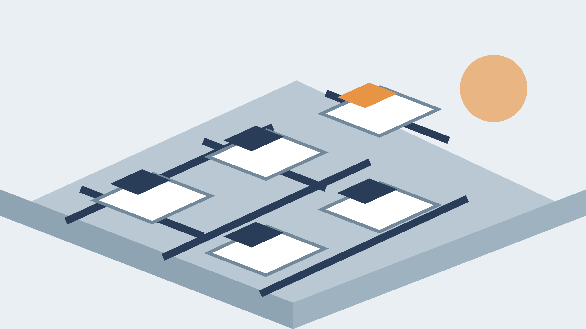

## A third floor that works as hard as your team does
layout: title
subtitle: A read-ahead for the facilities team before our walk-through on October 6. It covers what we measured, what we propose, how the install runs and what it costs.

## 58%
layout: big-number
caption: of desks on your third floor sat empty in an average working hour over four weeks

Notes:
Source: Cubicle 9 occupancy sensors on 120 desks, August 4 to August 29. Empty means no one at the desk for the whole hour.

## Empty desks cluster on Mondays and Fridays
layout: chart
subtitle: Share of third-floor desks in use, average working hour by weekday
takeaway: Midweek peaks at 74%, so 90 desks cover the busiest day with room

```chart
type: column
number_format: '0%'
labels: true
categories: [Monday, Tuesday, Wednesday, Thursday, Friday]
series:
  - name: Desks in use
    values: [0.46, 0.71, 0.74, 0.68, 0.31]
```

Notes:
Source: Cubicle 9 occupancy sensors, August 4 to August 29. The Wednesday peak was 89 desks at 11 am on August 20.

## We propose three zones in place of an open floor
layout: cards-3
kicker: The proposal
subtitle: Each zone is built from the same Cubicle 9 frame, so it can change later
label1: Focus rows
footer1: 60 desks
label2: Team neighborhoods
footer2: 30 desks and 6 tables
label3: Quiet rooms
footer3: 8 rooms
takeaway: The floor keeps its footprint and seats 40% more people midweek

### body1
- **Sit-stand desks** with a 54-inch screen wall
- Bookable by the day from the existing app
- Power and data in every desk spine
- Along the window wall, with the best daylight

### body2
- **Clusters of five** around a shared table
- A whiteboard wall for each team
- Lockers within ten steps of every seat
- Each team keeps its own neighborhood

### body3
- **Two-person rooms** for calls and reviews
- Glass fronts with a frosted band
- No booking needed under one hour
- Sound-rated panels on the core wall

Notes:
Desk counts assume the current headcount of 168 and the midweek peak of 89 desks in use.

## The install runs over five weekends
layout: process-5
kicker: The schedule
subtitle: Your team works every weekday of the install
step1: Survey
text1: We confirm power, data and floor loads on October 10, and you sign off the final plan the same week.
step2: Strip out
text2: Old desks leave on the first weekend. About 70% go to recycling and the rest to a school charity.
step3: Spines
text3: Power and data spines go in over weekends two and three. Each desk row is live by Monday at 7 am.
step4: Furniture
text4: Desks, tables and room panels arrive on weekend four and are built in place by our own crew.
step5: Hand-over
text5: A walk-through with your team on weekend five, then a 30-day snag list that we close out.
takeaway: Five weekends, no lost workdays, one crew from survey to hand-over

## The refit paid for itself in the first year, because we gave back a whole floor of the lease and nobody on the team noticed the move.
layout: quote
attribution: Facilities lead at a 200-person regional insurer, a Cubicle 9 refit in 2025

## What the refit needs from your facilities team
layout: bands-3
kicker: Your part
label1: Before October 10
label2: During the install
label3: After the hand-over

### text1
- A floor plan with the current power and data drops marked
- One named contact who can approve changes on a weekend

### text2
- Building access for our crew from 7 am Saturday to 6 pm Sunday
- A Friday note to staff to clear desks before each weekend

### text3
- One **30-minute** review of the snag list each week for a month
- Desk-booking data shared monthly so we can tune the zones

## The floor plan we sketched for your walk-through
layout: image-right
kicker: The proposal
subtitle: Drawn from the August survey; final plan after October 10

- Focus rows run along the window wall, where daylight is best
- Team neighborhoods sit in the middle of the floor, near the lockers
- Quiet rooms line the core wall, away from the main aisle
- The kitchen and print room stay where they are today
- The main aisle widens to 1.5 m, wide enough for a cart and two people to pass
- Every desk is within 20 m of a fire exit, as it is today
- We reuse the existing ceiling grid, lights and carpet tiles

### image


## Let's walk the floor together on October 6
layout: closing
subtitle: "Questions before then to projects@example.com. Fixed price: 412,000 for the full refit, install included."
