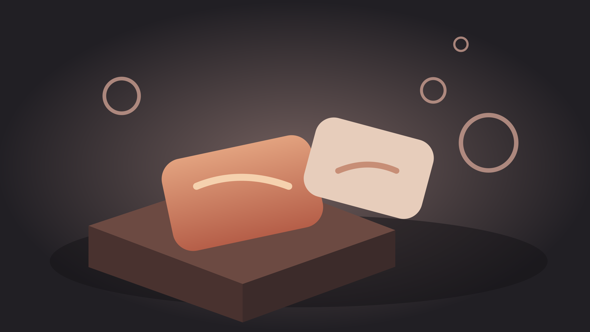

## Soap Club on the shelf at Larkspur Market
layout: title
subtitle: Small-batch bars that sell on smell, and a spring trial in 40 stores

## 38%
layout: big-number
caption: of first-time buyers come back for a second bar within 60 days

Notes:
Repeat buying is the reason a small brand earns a shelf. Most of our buyers find us once and stay.
Source: Soap Club web orders, January to September 2026, 4,120 first-time buyers.

## Three bars make up 82% of what we sell
layout: cards-3
kicker: The range
label1: Oat & Lavender
footer1: 41% of units
label2: Cedar Smoke
footer2: 24% of units
label3: Salt Scrub
footer3: 17% of units

### body1
- Best seller since 2023
- Gentle for daily use
- **Unscented** on request

### body2
- Dark and woody
- Bought as a gift
- Sells out every **December**

### body3
- Sea salt and **olive oil**
- For working hands
- Lasts two months

Notes:
Each bar is cut by hand and cured for six weeks. Oat & Lavender is gentle enough for every day; Cedar Smoke is the bar people buy as a gift.
Source: unit shares from all channels in the 2026 fiscal year. The other 18% is spread over five seasonal scents.

## Every trial stockist sold more each week
layout: chart
kicker: Proof
subtitle: Average units per store, three stockists, first six weeks
takeaway: Sales rose every week with no promotion and no discount

```chart
type: column
number_format: '#,##0'
labels: true
legend: false
categories: [Week 1, Week 2, Week 3, Week 4, Week 5, Week 6]
series:
  - name: Units per store
    values: [42, 55, 61, 70, 78, 86]
```

Notes:
The three trial stockists are independent gift shops in towns about the size of a Larkspur catchment.
Source: stockist sell-through reports, March to April 2026.

## The bars stand out on any shelf
layout: image-right
subtitle: A shelf of plain boxes makes a hand-cut bar look better

- Hand cut, so no two bars look the same
- Wrapped in plain recycled paper
- Colors come from the oils and clays
- Scent you can smell through the wrap

### image


## Five steps from order to shelf
layout: process-5
kicker: How it works
icon1: brand:icon/document
step1: Order
text1: Order by the case; no trial minimum.
icon2: brand:icon/box
step2: Pack
text2: 24 cured bars a case, ready to shelve.
icon3: brand:icon/delivery
step3: Ship
text3: At your depot in five working days.
icon4: brand:icon/spark
step4: Display
text4: A free crate fixture with the first order.
icon5: brand:icon/growth
step5: Reorder
text5: Reorder by email; restocked in a week.
takeaway: Your stores get the first order within three weeks

Notes:
The three weeks include the depot's own handling time.

## We put Soap Club by the till as a test. Within a month it was our best seller under ten dollars, and people came back asking for it by name.
layout: quote
attribution: Mara Quill, owner, Hollow Lane Goods

## The trial puts no risk on Larkspur
layout: bands-2
kicker: Terms
label1: Sale or return
label2: Fixtures and staff notes

### text1
- Unsold stock after **90 days** comes back at our cost
- Full credit for the case, no restocking fee

### text2
- One crate fixture per store, free
- A one-page staff note on each **scent**

Notes:
These are the same terms our three trial stockists signed. None of them returned stock.

## Start the trial in 40 stores this spring
layout: closing
subtitle: Orders and questions to wholesale@example.com
